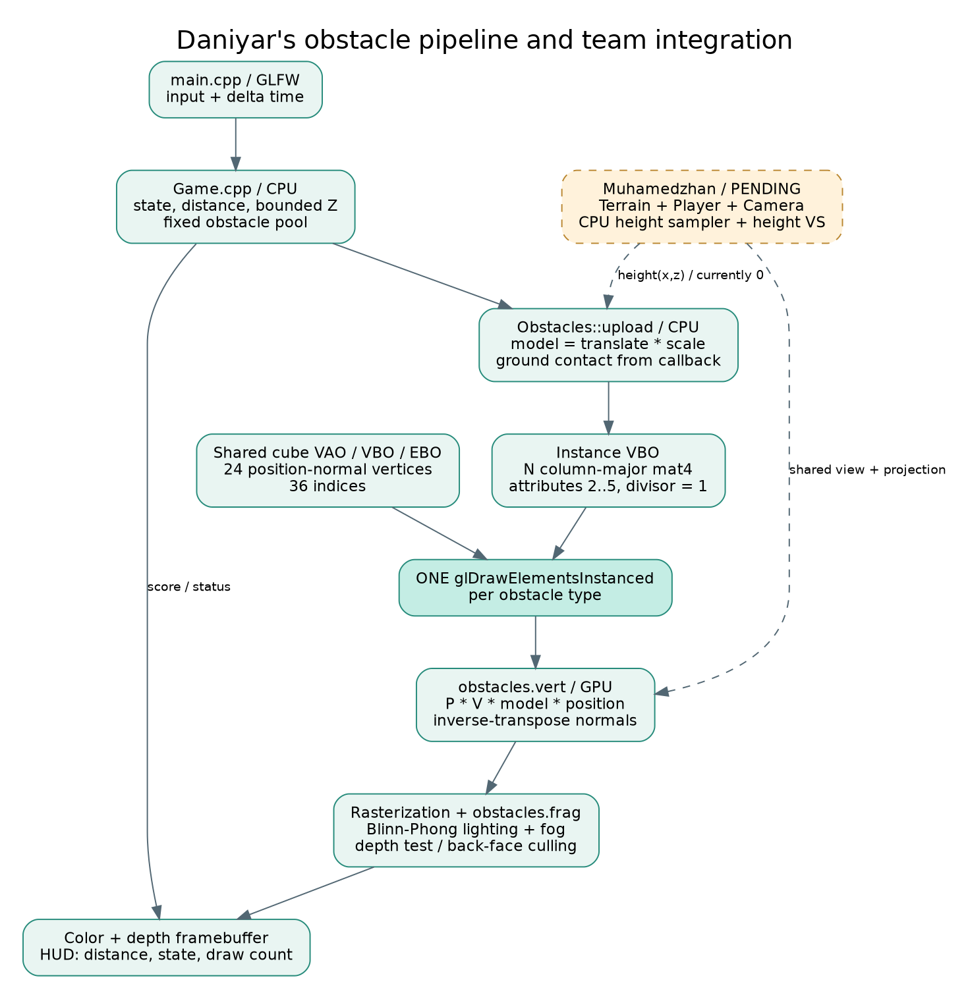
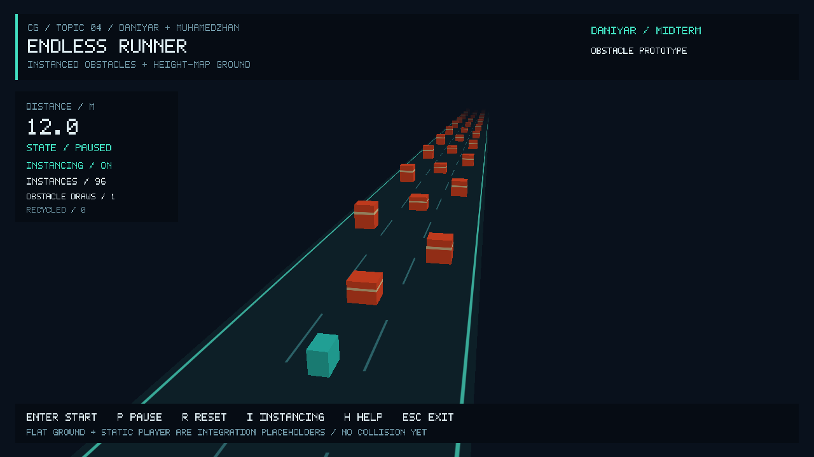

# Midterm report draft — Daniyar's assigned sections

**Historical draft of the standalone obstacle module, before integration of teammate commit b461826. The current build uses FreeGLUT/GLAD, a real height-map ground/player, shared 8 m/s speed and a 128 m terrain period. Screenshots, equations involving the former 12 m/s / 256 m settings, library descriptions and performance numbers below document the earlier build. Update these sections with docs/STAGE1_INTEGRATED_VALIDATION.md before submitting the team report.**

**Astana IT University — Computer Graphics Fundamentals**

Academic year 2026–2027. Topic 4: **Endless runner with instanced obstacles and a height-map ground**.

Team: Daniyar (Данияр) and Muhamedzhan (Мухамеджан). Group: **[ADD GROUP]**. Full names and official Latin spelling: **[CONFIRM BEFORE SUBMISSION]**.

This document contains Daniyar's assigned midterm sections and evidence from the current obstacle prototype. It must be merged with Muhamedzhan's Introduction and Project Description (Objective, Problem Statement, Scope), terrain explanation, and the integrated scene evidence. It is not a complete final-project report.

## 1. Literature Review / Background

Real-time rendering transforms object vertices into a shared scene, projects them through a camera and computes visible fragment colours. The course's introductory lectures describe this pipeline as vertex processing, primitive assembly, clipping, rasterization and fragment processing (Batkuldinova, n.d.-a). An endless runner contains repeated obstacle shapes, making it suitable for sharing geometry between many scene objects.

The transformations and coordinate-system practice sessions establish the model, view and projection matrices. A model matrix places an object in world space; the view matrix expresses that world relative to the observer; the projection matrix produces homogeneous clip coordinates. With column vectors, the rightmost transformation acts first. The prototype follows the GLM convention and constructs each obstacle from identity using translation and scale, then applies P × V × M in the vertex shader (Batkuldinova, n.d.-b, n.d.-c).

Drawing repeated meshes with separate draw calls reuses vertex storage but still requires a CPU submission per object. Instanced rendering also shares the draw submission: the same indexed mesh is processed for multiple instances, while a separate buffer provides per-instance attributes (de Vries, n.d.; Khronos Group, n.d.-a). In this project each instance carries a 4×4 model matrix. Its four columns occupy four vertex attribute locations, each with a divisor of one; the columns advance once per instance (Khronos Group, n.d.-b). This reduces obstacle draw calls from N to one for the single obstacle type. It does not remove vertex processing or guarantee higher FPS in every workload.

The models lecture explains indexed polygon representations and consistent outward winding. The prototype uses a cube with 24 position/normal vertices and 36 indices, retaining separate vertices across hard face-normal boundaries. The shading lecture describes ambient, diffuse and specular lighting and the halfway vector. A per-fragment Blinn–Phong model is used so the boxes respond to the light direction and viewing position (Batkuldinova, n.d.-d). This gives a visible way to inspect correct geometry and transformed normals.

## 2. Technical Implementation — Tools and Technologies Used

| Tool / library | Role in the current build |
|---|---|
| C++17, GCC 14.2 | Application and CPU simulation; no full game engine |
| OpenGL 3.3 core API, GLSL 330 | Custom indexed instancing and vertex/fragment programs |
| GLFW 3.4 | Window, context, keyboard state and framebuffer size |
| GLEW 2.2 | OpenGL entry-point loading |
| GLM 0.9.9.8 | Column-major matrices, perspective, LookAt and transforms |
| CMake 3.31.6, Ninja 1.11.1 | Repeatable build; documented Windows Visual Studio/vcpkg route |
| CTest | CPU simulation regression test |
| Mesa llvmpipe, Xvfb | Cloud render validation using a software driver and virtual display |

The cloud driver provides OpenGL 4.5 core, while the program requests 3.3 core and uses GLSL 330. Shaders are external files with checked compilation and linking. The CPU simulation has no OpenGL dependency. There are no external texture, model or font-image assets: the cube, markings and bitmap HUD alphabet are generated in code. Third-party library licences and URLs are recorded in `docs/THIRD_PARTY.md`.

## 3. Technical Implementation — Development Process

The prototype was developed as a separate obstacle module so it can be connected to the teammate's terrain, player and camera. The initial repository contained only a README. A CMake application, shader loader and temporary inspection scene were added. The geometry uses counter-clockwise faces and depth testing. The scene uses perspective projection with the current framebuffer aspect ratio and an orbit camera.

The obstacle renderer allocates one mesh VBO/EBO and a separate instance VBO. The simulation creates a deterministic pool of 96 boxes across three lanes. Each frame updates their bounded longitudinal positions and distance, then constructs and uploads model matrices. The buffer is orphaned with glBufferData and filled with glBufferSubData to allow the driver to avoid overwriting storage still in use.

An individual-draw fallback was added before comparison: both modes use the same mesh, shader, matrix list, camera and lighting. The I key switches between them and the HUD shows the actual number of obstacle submissions. CPU checks cover time-based movement, scoring, pause, reset and repeated wrapping. A separate OpenGL smoke mode checks visible pixels and compares the images from both draw paths.

The supplied course material informed the geometry, matrix, camera, input and lighting conventions. This implementation was substantially prepared with OpenAI Codex assistance. The students still need to review and adapt the code, explain the shader at the defence, and document the work they personally perform after this draft.

## 4. Algorithms and Techniques — Instancing Pipeline

Inputs are the shared cube positions/normals and indices, N instance model matrices, the view/projection matrix, eye position, light direction and material settings. The single obstacle pass uses glDrawElementsInstanced. Each vertex receives the model matrix of its instance, computes world and clip position, and transforms its normal. Rasterization interpolates world position and normal. The fragment shader evaluates lighting and distance fog. Depth testing and back-face culling determine visibility. The HUD is a separate overlay pass.



For a local vertex p, the implemented transform is:

```text
M_i = T(x_i, groundHeight(x_i,z_i) + height_i/2, z_i) * S(width_i,height_i,depth_i)
p_clip = P * V * M_i * vec4(p, 1)
n_world = normalize(transpose(inverse(mat3(M_i))) * n_local)
```

The inverse-transpose corrects normals under non-uniform scaling. The matrix is column-major; GLM uniform uploads use GL_FALSE. A mat4 consumes four consecutive vec4 locations (2–5), with stride sizeof(glm::mat4) and offsets 0, 16, 32 and 48 bytes. Each has glVertexAttribDivisor(location, 1).

For unit world-space normal N, light direction L, eye direction V and halfway vector H = normalize(L + V), the lighting before fog is:

```text
d = max(dot(N,L), 0)
s = d > 0 ? pow(max(dot(N,H), 0), 32) : 0
C_lit = C_base * (0.28 + 0.72*d) + vec3(0.22)*s
C_out = mix(C_lit, C_fog, smoothstep(65,220,distance(eye,worldPosition)))
```

All lighting quantities are in world space. L can rotate with the L key. Obstacle stripe colour and floor lane markings are procedural. These markings do not displace the floor and are not a height map.

## 5. Algorithms and Techniques — Motion, Recycling and Score

The right-handed world uses +Y up, +X right and −Z forward. The player marker stays at Z = 0; obstacles approach along +Z. At fixed speed v = 12 m/s, travel = v × dt. Distance accumulates in double precision and is displayed in metres. Ready and paused states do not advance the simulation.

Each obstacle begins at z_i = −18 − 6i. Pool length is L = 6N + 30. After adding travel, if z_i > 12, the code subtracts ceil((z_i − 12) / L) × L. This handles even multiple wraps in one update, keeps a constant object count and bounds local coordinates. Reset restores the original deterministic pool and zero score.

The future terrain phase is separately bounded with phase = (phase + travel) mod 256. A repeatable height-map sampler should use longitudinal coordinate phase − localZ and the same interpolation/UV rules on the CPU and in the vertex shader. The renderer accepts a height callback for this integration; the current callback returns zero. Player collision and ground displacement are not implemented by that callback alone.

## 6. Preliminary Demo and Controls



Reproduce this screenshot with `endless_runner --smoke-test --screenshot artifacts/daniyar-instancing.ppm`. It is captured from the project executable after one simulated second. For an interactive demonstration, launch the app, press Enter, pause with P, and press I to compare the same scene with 1 versus 96 obstacle draws. Arrows orbit the camera, Q/E zoom, C resets the view, L rotates the light, R resets the simulation, H/F1 displays help and Esc exits.

The module can continue simulating and recycling without restarting the process. The cyan cube is a marker, not a playable character. No collision or game-over response should be inferred from the screenshot.

## 7. Validation and Performance Notes

The Release build and CTest passed. The one CPU test executes 212 checks covering ready/run/pause/reset, distance, direction, recycling, fixed pool size, 75-second frame-rate independence at 30 versus 144 steps per second, invalid input, and long-run coordinate bounds. The GL smoke test validates the four divisor values, a single instanced call versus 96 individual calls, zero image differences beyond one colour-channel value, visible geometry, motion, light response, window resize and no GL errors.

Measurements below use the cloud's llvmpipe software renderer on an Intel Xeon Platinum 8573C, 1280×720, Release build. Each mode uses 20 warmup and 120 measured frames, VSync and HUD off, a fixed scene and glFinish after every frame. Transform upload occurs before timing. These are completed-frame wall times, not GPU timer-query measurements.

| Submitted instances | Mode | Obstacle draws | Frame time (ms) | FPS |
|---|---|---|---|---|
| 96 | ON | 1 | 2.967 | 337.033 |
| 96 | OFF | 96 | 3.378 | 296.017 |
| 1000 | ON | 1 | 3.609 | 277.085 |
| 1000 | OFF | 1000 | 3.980 | 251.227 |

The final run shows lower frame times for the instanced path at both counts; earlier exploratory runs did not consistently show a benefit at 96 instances. Many submitted instances are outside the view frustum and there is no CPU culling. The table measures draw-submission cost for this scene, not 1000 simultaneously visible obstacles or the complete animated gameplay loop. Cloud scheduling affects small differences, so these numbers are not a universal speedup claim. Windows compilation and the target lab-PC frame-rate requirement remain unverified.

## 8. Topic 4 Feature Checklist

The requirement wording is copied from Section 6 of the supplied assignment.

| Must implement | Status |
|---|---|
| Forward-running character or vehicle with jump / lane-change / slide (at least one evasion control). | Missing: teammate's player/evasion work; static marker only. |
| Ground is a height-map (displacement in vertex shader or tessellation if available); tiling or scrolling so the run is endless. | Missing: flat reference floor only. |
| Obstacles drawn with GPU instancing (one draw call per obstacle type, instance buffer with transforms). | Done in module: one cube type, instanced draw and matrix buffer. |
| Collision against height-map and instances; game-over and restart. | Partial: reset exists; collisions and game-over missing. |
| Speed increases over time or by score; on-screen score. | Partial: distance score done, speed fixed. |

Technical expectation: indexed GPU instancing and bounded obstacle/phase coordinates are implemented. Height texture sampling in the VS and integrated terrain/player origin handling remain pending. Final submission also needs a complete team report, official names/group, lab-machine validation and a 60–120 second backup video with an accessible link. Video link: **[NOT RECORDED YET]**.

## 9. Individual Contribution Plan and Current Artifacts

| Member / role | Assigned work and current artifact |
|---|---|
| Daniyar | Game.cpp, Obstacles.cpp, obstacle shaders; motion/recycling/score; Background, Tools, Development Process, instancing description and architecture links. Initial implementation and report draft prepared with Codex; student review/adaptation pending. |
| Muhamedzhan | Terrain, Player, Camera and terrain shaders; Introduction and Project Description; terrain implementation explanation. Not present in this checkout yet. |
| Shared | main.cpp, build/README, integration, feature checklist, final evidence and defence. Temporary harness provided; complete scene integration pending. |

This table describes assigned ownership and repository state, not verified unaided authorship. Before submission, replace the pending notes with a truthful account of each person's actual changes, tests and explanations.

## 10. References (APA 7)

Batkuldinova, K. (n.d.-a). *Computer Graphics Fundamentals: Introductory lectures, OpenGL, input, geometry, models and viewing* [Course slides]. Astana IT University. Supplied L-1, L-1-2, L-2-2, L-3-1, L-3-2, L-4-1, L-4-2 and L-5-1 files.

Batkuldinova, K. (n.d.-b). *Practice session: Transformations* [PowerPoint slides]. Astana IT University.

Batkuldinova, K. (n.d.-c). *Practice session: Coordinate systems, camera, and color* [PowerPoint slides]. Astana IT University.

Batkuldinova, K. (n.d.-d). *Shading* [Course slides, L-5-2_Shading.pdf]. Astana IT University.

de Vries, J. (n.d.). *Instancing*. LearnOpenGL. https://learnopengl.com/Advanced-OpenGL/Instancing

Khronos Group. (n.d.-a). *glDrawElementsInstanced*. OpenGL reference pages. https://registry.khronos.org/OpenGL-Refpages/gl4/html/glDrawElementsInstanced.xhtml

Khronos Group. (n.d.-b). *glVertexAttribDivisor*. OpenGL reference pages. https://registry.khronos.org/OpenGL-Refpages/gl4/html/glVertexAttribDivisor.xhtml

OpenAI. (2026). *Codex* [AI coding assistant]. https://openai.com/codex/

Assistance disclosure: OpenAI Codex generated substantial initial C++/GLSL code, tests, documentation and this draft in the project workspace on 8 October 2026. The named students must review, adapt and understand it; the draft is not a statement that they independently authored the current implementation. No external screenshot, model or texture is used as project evidence.
