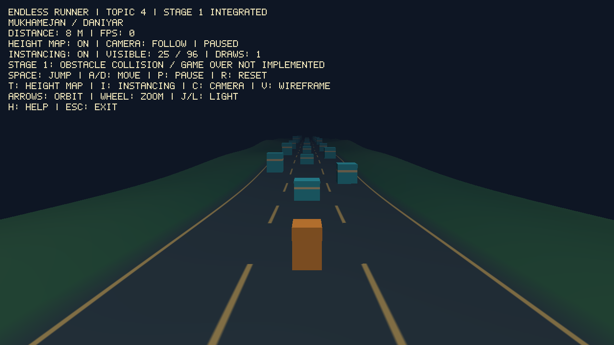
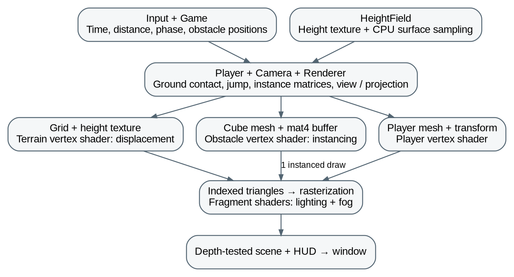

# Endless Runner — Midterm Report

**Course Name:** Computer Graphics Fundamentals

**Project Title:** Endless runner with instanced obstacles and a height-map ground

**Topic Number:** 4

**Team Members:** Mukhamejan Abdikerim and Daniyar Azizayev, IT-2511

**Instructor:** Kamila Batkuldinova

**Date of Submission:** 8 October 2026

## Table of Contents

## 1. Introduction

This project is a 3D endless runner built with OpenGL. It demonstrates two graphics techniques: a scrolling height-map ground and GPU-instanced obstacles. The midterm result combines terrain, a controllable player, camera, lighting, repeated obstacles and a distance score in one scene.

## 2. Literature Review/Background

Procedural modelling reduces dependence on external assets (Smelik et al., 2014). Noise research provides richer surface detail (Lagae et al., 2010; Perlin, 2002), while hydrology and erosion methods produce realistic landforms (Génevaux et al., 2013; Cordonnier et al., 2016). Our prototype uses simpler periodic sine and cosine height data so that scrolling remains repeatable.

Geometry clipmaps and BDAM address terrain detail and large datasets (Losasso & Hoppe, 2004; Cignoni et al., 2003). Visibility methods reduce unnecessary rendering (Bittner et al., 2004; Mattausch et al., 2008). Our smaller scene uses a fixed grid, terrain-range filtering and shared obstacle geometry. OpenGL instancing supplies a different model matrix for each copy in one draw call (Segal & Akeley, 2010).

Phong (1975) established an influential local shading model. Cook and Torrance (1982) and Schlick (1994) describe material reflectance, while Whitted (1980) extends illumination with ray tracing. This project uses inexpensive Blinn–Phong-style lighting without physically based materials or ray tracing. Collision surveys and bounding-volume methods inform future obstacle interaction (Teschner et al., 2005; Klosowski et al., 1998); this stage implements only terrain contact.

## 3. Project Description

### 3.1 Objective

Create an interactive runner that visibly demonstrates height-map displacement and GPU instancing, with controls to compare both techniques on and off.

### 3.2 Problem Statement

Terrain, player contact and obstacles must share the same scrolling phase. Repeated geometry should use few draw calls, and world coordinates must remain bounded during a long run.

### 3.3 Scope

Stage 1 includes terrain, movement, jumping, cameras, lighting, instanced obstacles, recycling, score, pause and reset. Obstacle collisions, game over and increasing speed remain future work.

## 4. Technical Implementation

### 4.1 Tools and Technologies Used

The application uses C++17, OpenGL 3.3 core and GLSL 330. FreeGLUT manages the window and input, GLAD 1 loads OpenGL functions, and GLM provides vector and matrix operations. Visual Studio supports the Windows project; CMake supports the cloud build. GitHub stores the shared source. FreeGLUT callbacks and GLSL syntax follow the library and language references (The freeglut Project, n.d.; Khronos Group, 2010).

### 4.2 Development Process

Mukhamejan Abdikerim’s module covers HeightField, Player, Camera and terrain rendering. Daniyar Azizayev’s module covers Game, Obstacles, obstacle shaders, the instance buffer, obstacle movement and recycling, and distance scoring. Integration connects both modules through one window, shared timing and a common ground sampler.

Daniyar’s report contribution covers the background, tools, development process and instancing explanation. The integrated source is recorded in GitHub commit 8d05385. Existing terrain, player and camera code was preserved during integration.

### 4.3 Algorithms and Techniques

The terrain vertex shader samples a 128 × 128 GL_R32F height texture to displace the mesh. The coded sampling equation is:

h(x, z, s) = 2.5 H(x / 24 + 0.5, (z − s) / 128)

H is the filtered height texture and s is the shared phase, wrapped every 128 m. CPU sampling follows the rendered mesh triangles for player and obstacle placement.

Each obstacle uses Mᵢ = T(xᵢ, hᵢ + heightᵢ/2, zᵢ) Sᵢ and pclip = P V Mᵢ p. Its mat4 occupies four attributes with divisor 1. glDrawElementsInstanced draws all submitted cubes. At 8 m/s, zᵢ and distance increase by 8Δt; obstacles passing z = 12 wrap behind the scene. The fixed pool contains 96 obstacles.

## 5. Graphics and Rendering

### 5.1 2D/3D Rendering Techniques

Indexed triangles pass through vertex shaders, rasterization and fragment shaders. Terrain, player and obstacles share perspective camera matrices, depth testing and back-face culling; the HUD is drawn afterwards. Figure 2 shows the module connections and rendering pipeline.

### 5.2 Lighting and Shading

Terrain normals come from neighbouring heights. Obstacles transform normals with the inverse-transpose model matrix. Fragment shaders combine ambient, diffuse and halfway-vector specular terms, then apply distance fog. The light direction can be rotated during the demo.

### 5.3 Texturing and Animation

The height texture, road markings and obstacle bands are generated procedurally. Terrain phase and obstacle translation create forward motion while the player stays near Z = 0. Jumping uses vertical velocity and gravity; no skeletal animation or external texture images are used.

## 6. Testing and Evaluation

### 6.1 Testing Methodology

The Linux Release build passed two automated tests containing 405 assertions. OpenGL checks covered pause/reset, jump and landing, terrain and instancing toggles, camera changes and resizing. CPU heights matched 17,297 actual terrain-shader vertices in five cases within 0.0001 m. The earlier terrain/player prototype ran on Windows; the integrated Windows build still needs a local check.

### 6.2 Performance Evaluation

At 1280 × 720, 25 submitted obstacles required one instanced draw instead of 25 individual draws, with equivalent images within a 1/255 colour tolerance. A Mesa llvmpipe software-renderer sample measured 7.798 ms (128.2 FPS) with instancing and 8.182 ms (122.2 FPS) without it. This used 120 frames after 20 warmup frames; updates, uploads, HUD and swapping were excluded. It is not a lab-GPU benchmark.

### 6.3 Issues and Debugging

Integration resolved differing window/loading libraries and synchronized ground sampling with obstacle motion. Terrain-range filtering prevents boxes appearing beyond the mesh. Obstacles remain upright and use bottom-centre ground contact; corner support on steep slopes is a remaining limitation.

## 7. Conclusion and Future Work

Both headline graphics techniques now work in one interactive prototype. The next stage will add obstacle collisions, game over, speed progression, Windows/lab-GPU validation and a demo video. Figure 1 shows the current integrated build.

Figure 1 is a paused test capture. Its FPS counter is inactive; measured timing results are reported in Section 6.2.

## 8. References

Bittner, J., Wimmer, M., Piringer, H., & Purgathofer, W. (2004). Coherent hierarchical culling: Hardware occlusion queries made useful. Computer Graphics Forum, 23(3), 615–624.

Cignoni, P., Ganovelli, F., Gobbetti, E., Marton, F., Ponchio, F., & Scopigno, R. (2003). BDAM—Batched dynamic adaptive meshes for high performance terrain visualization. Computer Graphics Forum, 22(3), 505–514.

Cook, R. L., & Torrance, K. E. (1982). A reflectance model for computer graphics. ACM Transactions on Graphics, 1(1), 7–24. https://doi.org/10.1145/357290.357293

Cordonnier, G., Braun, J., Cani, M.-P., Benes, B., Galin, E., Peytavie, A., & Guérin, E. (2016). Large scale terrain generation from tectonic uplift and fluvial erosion. Computer Graphics Forum, 35(2), 165–175.

Génevaux, J.-D., Galin, E., Guérin, E., Peytavie, A., & Benes, B. (2013). Terrain generation using procedural models based on hydrology. ACM Transactions on Graphics, 32(4), Article 143.

Khronos Group. (2010). The OpenGL shading language (Version 3.30). https://registry.khronos.org/OpenGL/specs/gl/GLSLangSpec.3.30.pdf

Klosowski, J. T., Held, M., Mitchell, J. S. B., Sowizral, H., & Zikan, K. (1998). Efficient collision detection using bounding volume hierarchies of k-DOPs. IEEE Transactions on Visualization and Computer Graphics, 4(1), 21–36.

Lagae, A., Lefebvre, S., Cook, R., DeRose, T., Drettakis, G., Ebert, D. S., Lewis, J. P., Perlin, K., & Zwicker, M. (2010). A survey of procedural noise functions. Computer Graphics Forum, 29(8), 2579–2600.

Losasso, F., & Hoppe, H. (2004). Geometry clipmaps: Terrain rendering using nested regular grids. ACM Transactions on Graphics, 23(3), 769–776.

Mattausch, O., Bittner, J., & Wimmer, M. (2008). CHC++: Coherent hierarchical culling revisited. Computer Graphics Forum, 27(2), 221–230.

Perlin, K. (2002). Improving noise. ACM Transactions on Graphics, 21(3), 681–682.

Phong, B. T. (1975). Illumination for computer generated pictures. Communications of the ACM, 18(6), 311–317. https://doi.org/10.1145/360825.360839

Schlick, C. (1994). An inexpensive BRDF model for physically-based rendering. Computer Graphics Forum, 13(3), 233–246.

Segal, M., & Akeley, K. (2010). The OpenGL graphics system: A specification (Version 3.3, core profile). Khronos Group. https://registry.khronos.org/OpenGL/specs/gl/glspec33.core.pdf

Smelik, R. M., Tutenel, T., Bidarra, R., & Benes, B. (2014). A survey on procedural modelling for virtual worlds. Computer Graphics Forum, 33(6), 31–50.

Teschner, M., Kimmerle, S., Heidelberger, B., Zachmann, G., Raghupathi, L., Fuhrmann, A., Cani, M.-P., Faure, F., Magnenat-Thalmann, N., Strasser, W., & Volino, P. (2005). Collision detection for deformable objects. Computer Graphics Forum, 24(1), 61–81.

The freeglut Project. (n.d.). The freeglut application programming interface. https://freeglut.sourceforge.net/docs/api.php

Whitted, T. (1980). An improved illumination model for shaded display. Communications of the ACM, 23(6), 343–349.

## 9. Appendix

Figure 2 connects the shared game state to terrain displacement, instanced obstacles and the final shaded scene.

### Topic 4 feature checklist

- **Done.** Forward-running character or vehicle with jump / lane-change / slide (at least one evasion control).
- **Done.** Ground is a height-map (displacement in vertex shader or tessellation if available); tiling or scrolling so the run is endless.
- **Done.** Obstacles drawn with GPU instancing (one draw call per obstacle type, instance buffer with transforms).
- **Partial.** Collision against height-map and instances; game-over and restart. Ground contact and reset work; instance collisions and game over are pending.
- **Partial.** Speed increases over time or by score; on-screen score. Distance is displayed; speed is currently constant.

### Controls and scene inspection

Space: jump; A/D: move; P: pause; R: reset; T: height map; I: instancing; C: follow/orbit camera; arrows/wheel: orbit/zoom; J/L: light; V: wireframe; H: help; Esc: exit. To inspect the scene, run briefly, pause with P, switch to orbit with C and adjust the view. Compare T and I without changing the scene.

### Sources, assets and AI assistance

ChatGPT/Codex assisted with source code, shaders, integration, automated checks and report preparation. The responsibilities in Section 4.2 describe module ownership, not unaided authorship. Scene geometry and texture data are generated in code; the cover logo comes from the supplied university template.

Project source: https://github.com/nneznauu/cg-endless-runner (commit 8d05385).
