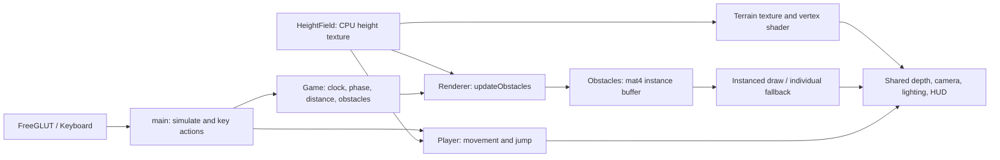

# Integrated Stage 1 contract

Base: teammate commit `b461826`. All application source lives in `src/` and all shaders in `shaders/`. `EndlessRunner.vcxproj` and CMake compile the same application modules. The existing Windows `Dependencies.props` paths remain valid. FreeGLUT creates the only window; GLAD 1 loads the only OpenGL API. The old GLEW/GLFW/Hud wrapper is removed from the application.

## Coordinates, time and ground contact

- Right-handed world, +Y up, +X right, −Z forward; player Z = 0, obstacles approach along +Z.
- `Game` owns distance, obstacle positions, pause state and bounded phase. Speed is **8 m/s**. `Game::GroundPeriod` references `HeightField::period`, currently **128 m**; there is no separate 256 m runtime constant.
- `main::simulate` updates Game once, copies the current phase to renderer/player arguments, then updates Player. Pausing prevents all three updates. The interactive dt cap is the teammate's 0.05 s.
- Height texture coordinates use `(z - phase) / period`. `Renderer::updateObstacles` calls `terrain.surfaceHeight(x, z, game.groundPhase(), displaced)` with **local z**, not `phase-z` or a second phase subtraction.
- `surfaceHeight` matches texture filtering and the triangles used by the terrain index buffer. The obstacle bottom centre uses this height; centre Y adds half its height. Boxes remain upright; steep-slope corner support is not implemented.
- Player has full dimensions 0.8 × 1.2 × 0.8. `feetY` is the bottom and horizontal motion is clamped to [−4.2,4.2].
- Rendering filters obstacles whose full Z extent would exceed the terrain mesh. Off-terrain pool entries continue moving/recycling but cannot float beyond the end of the mesh. This is terrain-range filtering, not full camera-frustum culling.

## Shared input and resources

P freezes distance/phase, player physics and obstacles together. R resets Game and Player and preserves the previous pause state. T changes both the terrain VS height scale and the CPU ground sampler used by Player and obstacles. I switches draw submission without moving or hiding the obstacles. C retains follow/orbit; it is no longer the old standalone reset-view binding. Space remains jump. Windows virtual-key polling now includes I.

Renderer owns the obstacle program and resources. `Obstacles::initialize()` runs only after a GL context exists; `shutdown()` runs before it is destroyed. The global Renderer constructor performs no GL calls. Obstacles uses the shared `loadProgram`, GLAD and GLuint program API. All shaders stay external. The HUD shows pool size, submitted instances and obstacle draw count.

`loadProgram` has an optional transform-feedback varying used to validate positions from the actual terrain vertex shader. Ordinary rendering is unchanged by this link-time option. The smoke test reads all mesh vertices and compares them to the CPU height sampler at several phases and with displacement disabled.

## Ownership and next stage

HeightField/Player/Camera and their shaders come from Mukhamejan's Stage 1 commit; Game/Obstacles and obstacle shaders are Daniyar's module. Main, Renderer, Shader, Keyboard and build files now contain integration changes. Source moves are recorded as Git renames; verified pre-integration backups are outside the checkout under `/workspace/review-backups/`.

Next-stage work remains: obstacle collision, failure/game-over/restart after failure, speed progression, final report and lab-machine/video evidence. This integration preserves the documented Stage 1 scope.
